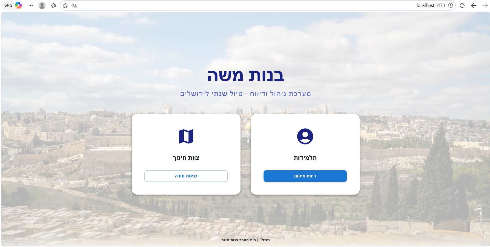
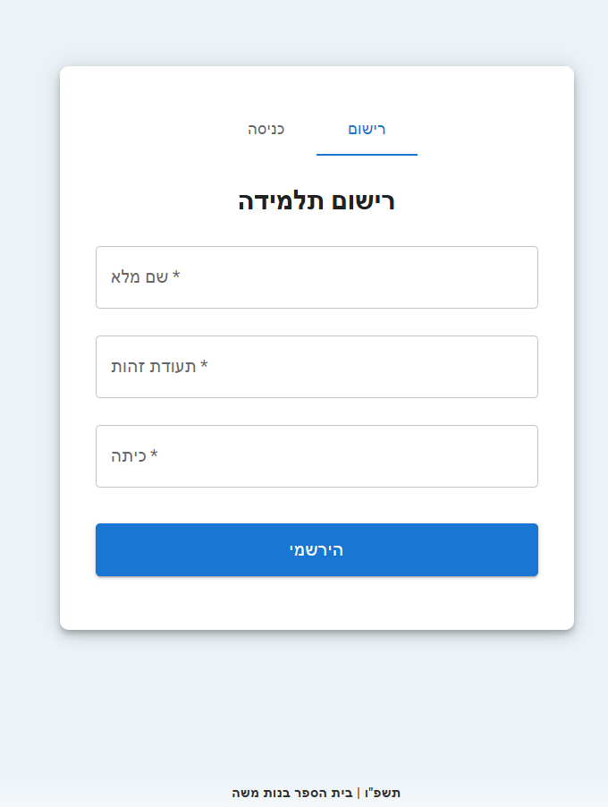

# פרויקט ניהול טיול - בנות משה

## טכנולוגיות
Backend - Node.js
Frontend - React
DB - mongoDB

## מבנה הפרויקט
- `/client` - קוד הפרונטנד (React & MUI)
- `/server` - קוד הבקנד (Node.js & Express)
- `/models` - סכימות של MongoDB

## Dependencies
- Frontend: Material UI, React Router, Axios
- Backend: Express, Mongoose, Dotenv, Cors

## אופן השימוש
מערכת לניהול תלמידות בטיול שנתי בירושלים.
בחירה בין מורה לתלמידה

מורה

DashBoard - מורה

תלמידה

DashBoard - תלמידה

## התקנה והרצה
1.  הורדת הפרוייקט - clone
2.  יש להריץ - npm install בצד השרת ובצד הלקוח
3. להפעלת השרת: `node app.js`.
4. להפעלת הממשק: `npm run dev`.

## הנחות מקלות
1. המערת מניחה שקיימת גישה ל-GPS בכל זמן נתון
2. אימות המשתמשים ובדיקות ולידציה מתבצע באופן בסיסי
לצורך הצגת היכולות הטכנולוגיות